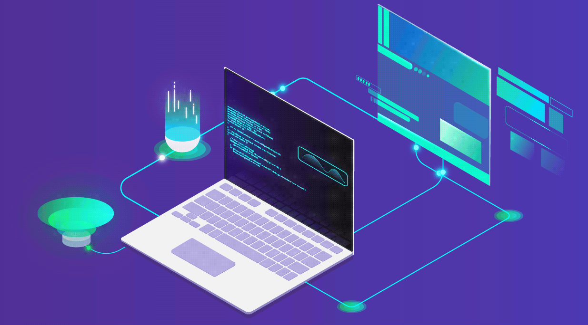

  

<h1 align="center">Hi 👋, I'm Chamitha Galhenage</h1>
<h3 align="center">Exploring the World of Technology</h3>

  

### Who am I?

I'm a passionate tech enthusiast, eager to explore the world of technology. With creativity and a range of skills, I'm ready to contribute to exciting projects.

<table align="center">
  <tr border="none">
    <td width="50%" align="left">
      - 🌱 I’m currently learning **MERN**  
      - 🧑‍🎓 I graduated from **Douglas College and University of Moratuwa**  
      - 💬 Ask me about **Java, JavaScript**  
      - 📫 Reach me at **engchamitha@gmail.com**  
      - ⚡ Fun fact: **Call me Cham (not Champ!)**  
    </td>
    <td width="50%" align="center">
      
    </td>
  </tr>
</table>

---

### My Statistics:

<table align="center">
  <tr border="none">
    <td width="50%" align="center">
      
        
      
    </td>
    <td width="50%" align="center">
      
    </td>
  </tr>
</table>

---

### Languages

  

---

### Front-end Frameworks/Libraries

  

---

### Back-end Frameworks/Libraries

  

---

### Databases

  

---

### Tools

  

---

### Version Control

  

---

### Top Repositories

---

### Connect with me:

  
  
  

